N64RGBv3 / N64RGB_Flex (PCB & Fw)
---

This repository contains all you need files to build your own DIY N64RGBv3 / N64RGB_Flex board.
Firmware is supplied in this repository, too.

Please don't ask me for selling a modding.
I either sell some prototypes on some forums marketplaces (which is very unlikely) or I don't have any of the boards.
This is a complete DIY modding project.
Everybody is on his own here.

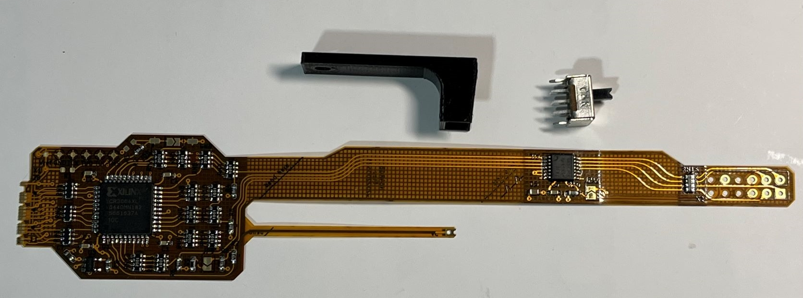

**WARNING:**
This is an advanced DIY project if you do everything on your own.
You need very good soldering skills.
The CPLD has 0.8mm fine pitched pins, the video amp 0.65mm pitch.
On the board there are some SMD1206 resistor and ferrite bead arrays.
However, there might be some awesome shops out there selling the boards for a great price.

## Table of Contents

- [Checklist](https://github.com/borti4938/n64rgb_flex#checklist-how-to-build-the-project)
- [Assembly](https://github.com/borti4938/n64rgb_flex#assembly)
- [Installation](https://github.com/borti4938/n64rgb_flex#installation)
  - [1. Open the Console](https://github.com/borti4938/n64rgb_flex#1-open-the-console)
  - [2. Solder Work](https://github.com/borti4938/n64rgb_flex#2-solder-work)
  - [3. Jumper Setup](https://github.com/borti4938/n64rgb_flex#3-jumper-setup)
  - [4. Finish the Work](https://github.com/borti4938/n64rgb_flex#4-finish-the-work)
- [Firmware](https://github.com/borti4938/n64rgb_flex#firmware)
- [Cable Setup](https://github.com/borti4938/n64rgb_flex#cable-setup)

## Checklist: How to build the project

- Use PCB files (either [KiCad-PCB design file](./pcb/n64rgb_v3.kicad_pcb) or [Gerber files](./pcb/gerber/)) to order your own PCB with following specs (might be not comprehensive)  
  - Size: 160.5mm x 27.5mm
  - Layer: 2
  - FPC thickness: 0.15mm
  - Min hole size: dia 0.25mm / ring 0.45mm or lower
  - Min trace width / spacing: 0.2mm
  - Stiffener: bottom
- If you paln to use solder paste, do not forget to order a stencil for top
- Source the components you need, e.g. from Mouser or Digikey.  
  The BOM is available in [here](./doc/ibom.html).
- Wait for everything to arrive
- Flash the [Firmware](https://github.com/borti4938/n64rgb_flex#firmware) either before assembly, after assembly or after installation to the CPLD after installation
- Assemble your PCB if you haven't use a PCBA service
- Set all jumpers

## Assembly

If you have all components available, you can start assembly your board.
**Please note**: if you plan to flash the firmware before assembly, go to the [Firmware](https://github.com/borti4938/n64rgb_flex#firmware) section first.
The documentation provides an [interactive BOM](./doc/ibom.html), which should guide you through the assbly.
There is no specific order for the assembly - just take your time.

Using non-clean flux (rosin based) is obviously recommended.
Even though it is "non-clean" I recommend cleaning everything afterwards (just for the visual finish).

Please double check everything for shorts once you finished your work.
Very important is that the power supply trace do not short to GND.
- 5V against GND (e.g. at C7 and at MultiOut pin 10 to 6)
- 3.3V against GND (e.g. at C8)

Flash the firmware after assembly if you plan to do so.

## Installation

### 1. Open the console

- Remove Jumper Pak / Expansion Pak
- Remove screws from bottom side of the console  
(needs a 4.5mm gamebit tool)
- Lift top housing
- remove inner screws as marked  
(very last consoles made the heat sink design changed slightly)
- pull out the mainboard
- remove heat sink and RF shield
- **Hint** Now you have the chance to clean up your N64 shell

(image by Zerberus (circuit-board.de user))

### 2. Solder Work

This PCB is designed as a custom flex cable which fits nicely into every N64.

#### 2.1 Digital inputs

Start with the digital side:
- Bend the input side like in an S-shape.  
This helps the solder connection to have minimal mechanical stress.

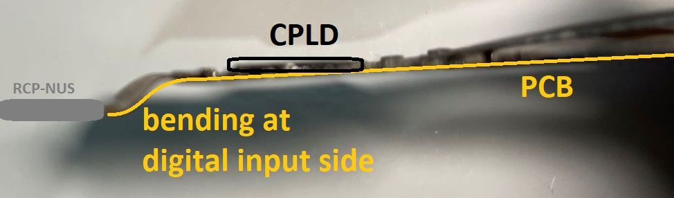

- Solder the RCP connector side to the RCP-NUS as shown
  - first pin bottom – 11
  - last pin to – 28
- Take your time for this step - after this one you are almost finished with your work

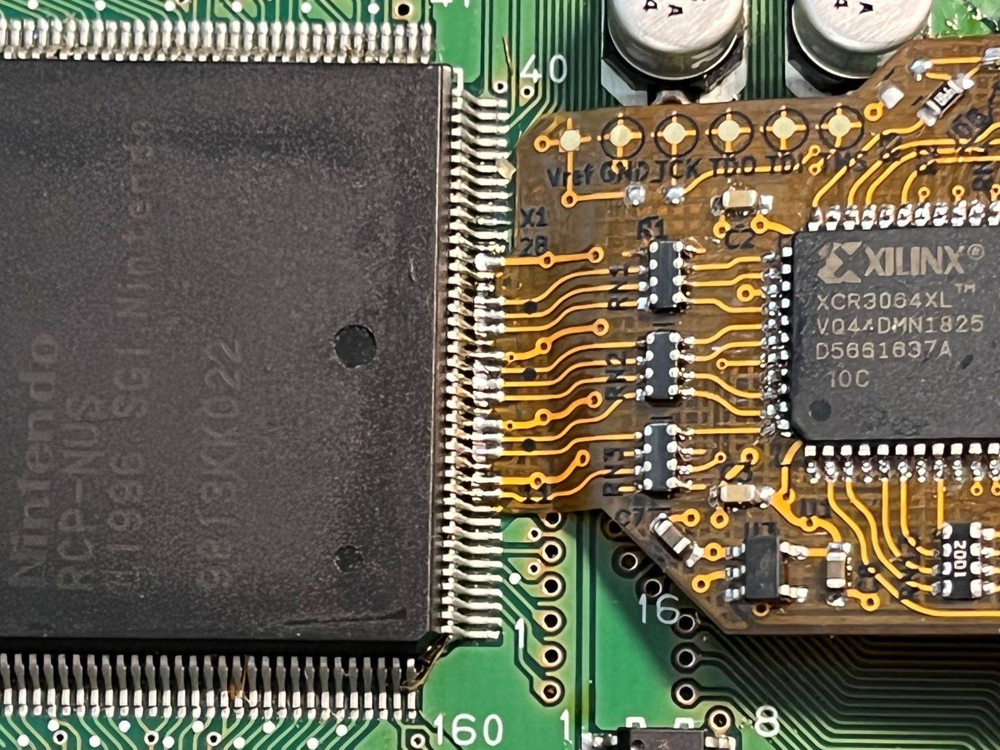

- Connect the 5V branch of the flex with the 5V output of U13.
- Bend the 5V branch below the upper end to reach U13.

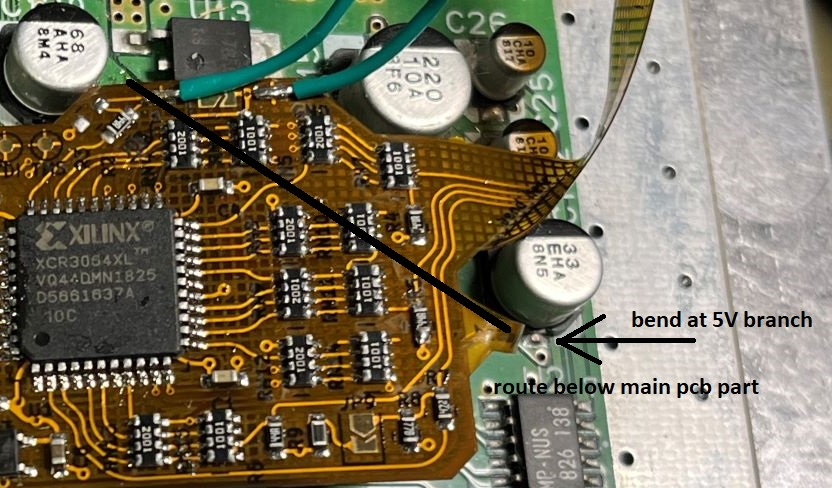

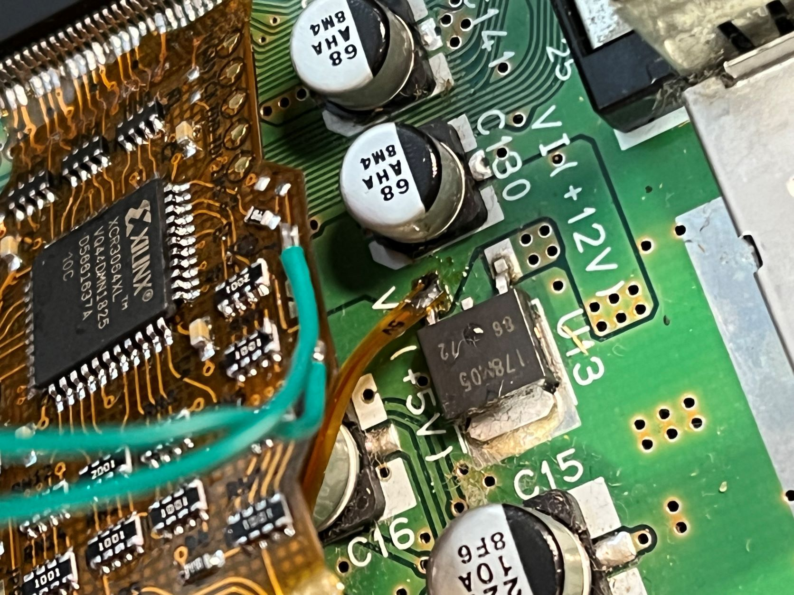

#### 2.2 Analog output

- Route the flex pcb to the MultiOut as shown.  
You need three bends:
  - Two rather sharp 90 degree ones
  - One round bending around the N64 PCB

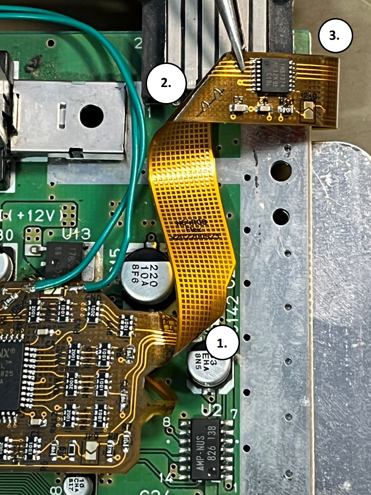
  
  
- Solder the MultiOut footprint to the MultiOut pins

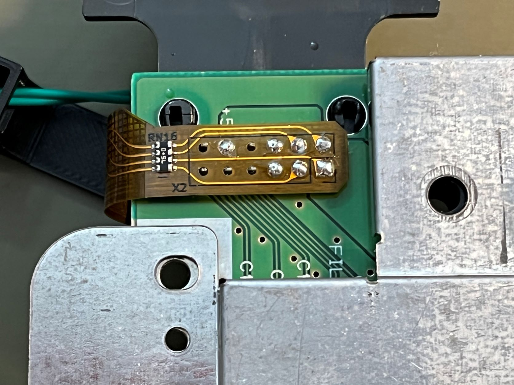

#### 2.3 Additional Step for NUS-CPU-01/-02/-03 boards

- remove R14
- or cut the trace going to pin 3 of the MultiOut

### 3. Jumper Setup

#### JP9 (CSYNC level @ pin 3 MultiOut)

- opened: appr. 1.87V @ 75ohm termination, i.e. needs a resistor inside the sync wire further attenuating the signal. Designed to work for cables with 470 ohm resistor inside resulting in appr. 450mV @ 75ohm termination
- closed: appr. 300mV @ 75ohm termination suitable for pass through wired cables at sync, works with standard TV / scaler setup

#### JP10 (low pass filter THS7374)

- opened: use low pass filter
- closed: bypass

#### JP11 - JP13 (Cable)

- all opened: NTSC cable
- all closed: PAL cable

#### JDB

For this jumper, it is recommended to use a slide switch (part no. is provided in the [BOM](./doc/ibom.html))

- opened: do not use vi-deblur for 240p output
- closed: permanently use vi-deblur for 240p output (not recommended at all)

### 4. Finish the Work

#### 4.1 VI-Deblur Switch

If you source the switch as provided in the [BOM](./doc/ibom.html), you can use [this 3D mount](https://www.thingiverse.com/thing:4584239) for a clean installation.
A copy of the STL is also provided [here](./3d_print/).
Please note and respect the license of the switch!

- Prepare the switch by cutting off two pins and a housing pin
- solder two wire of appr. 10cm length to a middle and an outside pin of the switch (same side)

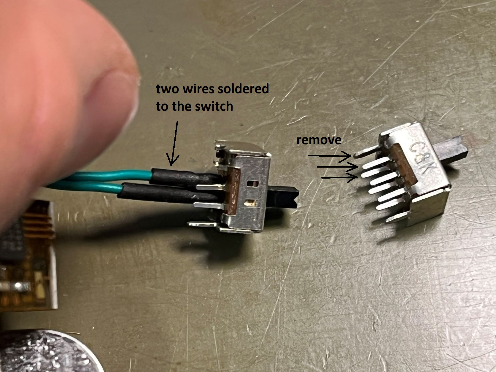

- run the wires through the 3d printed mount to the flex pcb
- solder the wires to the pads next to the JDB jumper

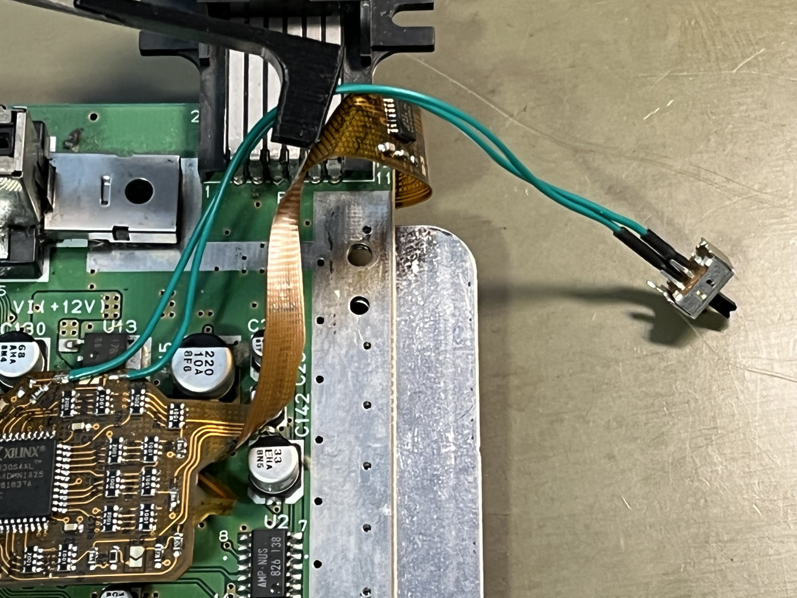

#### 4.2 Putting everything back together

- Before putting everyything back together, isolate the top RF shield at the area where the flex PCB is routed.

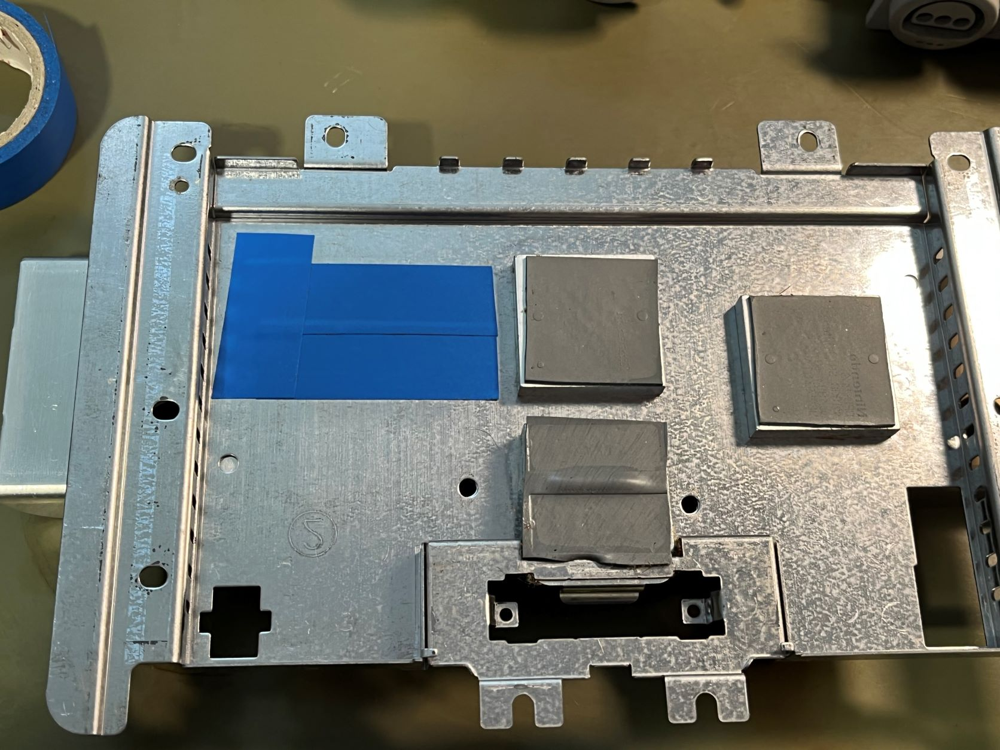

- Flash the firmware if not already done (go to section [Firmware](https://github.com/borti4938/n64rgb_flex#firmware)).
- Assemble the top RF shield
- Make a short test if everything is working as expected
- Screw the N64 mainboard into the bottom shell with the deblur switch attached as shown

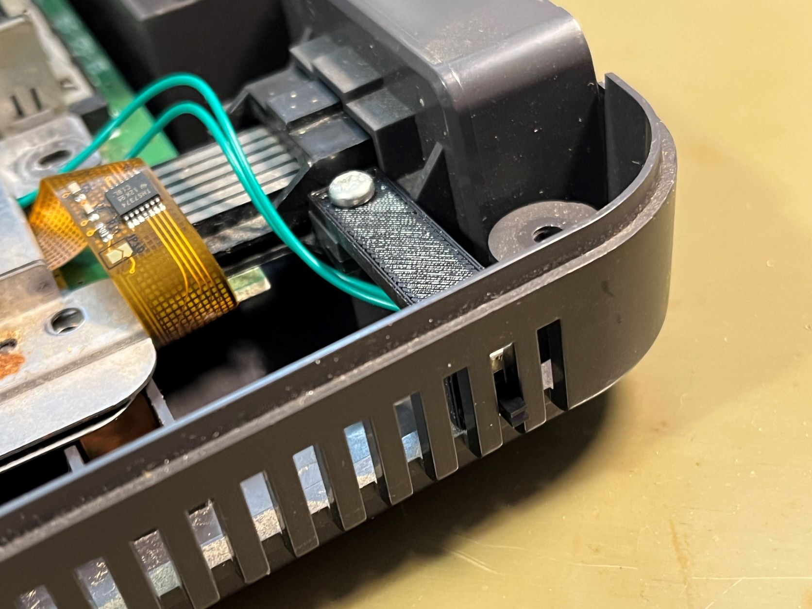

- Close the N64

## Firmware

Flashing the firmware to the CPLD is required to get the modding board working.
The firmware file depends on the CPLD you have.
Supported CPLDs are
- from AMD XILINX: XCR3064XL-VQ44
- from IntelFPGA (Altera): EPM7064AETC44 (obsolete)
Microchip replacements for the EPM7064 are not supported as they are too slow!

For programming the firmware you need to have:
- XCR3064XL CPLD:
  - [JTAGHS2 FPGA programming cable](https://www.digikey.de/de/products/detail/digilent-inc/410-249/3902812) or similar
  - ISE impact software which is part of the [ISE WebPACK Design Software](https://www.xilinx.com/products/design-tools/ise-design-suite/ise-webpack.html)
- EPM7064AETC44 CPLD:
  - [USB Blaster](https://www.digikey.de/de/products/detail/terasic-inc/P0302/2003484) or similar
  - Quartus Programmer which is part of the [Quartus II Web Edition Design Software Version 13.0sp1](https://www.intel.com/content/www/us/en/software-kit/711791/intel-quartus-ii-web-edition-design-software-version-13-0sp1-for-windows.html) or any other Quartus Prime software version

If you plan to flash the CPLD prior to assembly, you need a [TQFP44 adapter](https://www.aliexpress.com/item/4000842654907.html) in order to access Vcc (Vref), GND and JTAG pins.
You can use the [pinout file](./fw/quartus/output_files/n64rgb_flex.pin) generated by quartus for your orientation.
This pinout is obviously the same for the XCR3064XL CPLD.

If you flash the firmware prior to installation, you need also a way to power the Vref with 3.3V.
This job is done by the N64 after the installation.

Flash the firmware using the following steps:
- Open the programming software
- Load the firmware binary
  - [XCR3064XL](./fw/ise/n64rgb_flex.jed)
  - [EPM7064AETC44](./fw/quartus/output_files/n64rgb_flex.pof)
- Select the programmer cable if not already selected
- Select Program and Verify
- Run the programmer

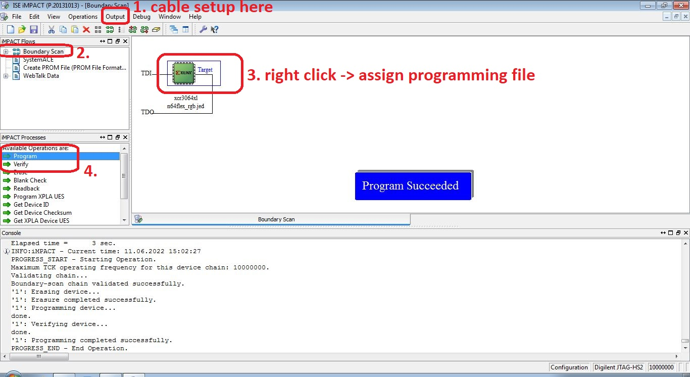

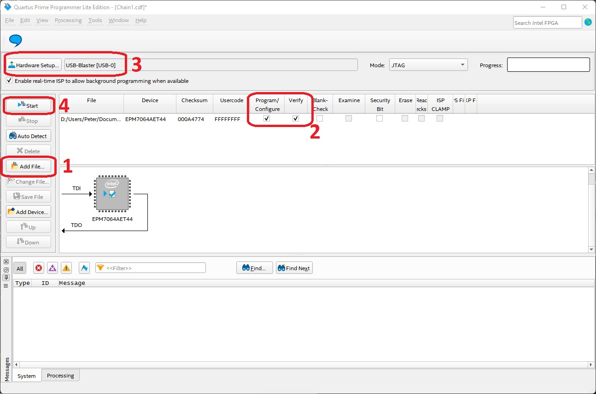

**Note:** In near future I will take a look on how to use OpenOCD for these two CPLDs.

## Cable Setup

#### NTSC SNES Cable

Cable setup is as like as a (standard) RGB cable for the NTSC-SNES

| Signal | Pin MultiOut | Pin SCART | Ref. GND in SCART | Note |
|:-------|:-------------|:----------|:------------------|:-----|
| Red | 1 | 15 | 13 | Using a 220uF cap in series is possible |
| Green | 2 | 11 | 9 | Using a 220uF cap in series is possible |
| Blue | 4 | 7 | 5 | Using a 220uF cap in series is possible |
| Sync | 3, 7 or 9 | 20 | 17 | Pin: See installation, Cable: see notes below |
| GND | 5, 6 | 4,5,9,13,17,18,21 | Pin 21 @ SCART: outer shield |
| +5V | 10 | 16 | 18 | SCART: use a 180ohm resistor in series |
| Audio left | 11 | 6 | 4 | |
| Audio right | 12 | 2 | 4 | |

#### PAL SNES Cable

Cable setup is as like as a (standard) RGB cable for the PAL-SNES

| Signal | Pin MultiOut | Pin SCART | Ref. GND in SCART | Note |
|:-------|:-------------|:----------|:------------------|:-----|
| Red | 1 | 15 | 13 | 75ohm resistor to GND (pin 13) |
| Green | 2 | 11 | 9 | 75ohm resistor to GND (pin 9) |
| Blue | 4 | 7 | 5 | 75ohm resistor to GND (pin 5) |
| Sync | 3, 7 or 9 | 20 | 17 | Pin: See installation, Cable: see notes below |
| GND | 5, 6 | 4,5,9,13,17,18,21 | Pin 21 @ SCART: outer shield |
| +5V | 10 | 16 | 18 | SCART: use a 180ohm resistor in series |
| Audio left | 11 | 6 | 4 | |
| Audio right | 12 | 2 | 4 | |

#### Notes on Sync:

- If you have a series resistor in you cable make sure that JP9 is opened!
- If you have a straightly wired sync connection make sure that JP9 is closed!

#### RGB cables:

- If you buy an RGB cable,
  - NTSC: buy a typical RGB cable for a NTSC SNES with sync on luma (MultiAV pin 7) or sync on csync (MultiAV pin 3).
  - PAL: buy a typical RGB cable for a PAL SNES with sync on luma (MultiAV pin 7). You can modify the cable to use sync on csync (MultiAV pin 3).
- If you bought a raw csync cable and if you use the 75ohm output, please ensure to set J31 correctly
